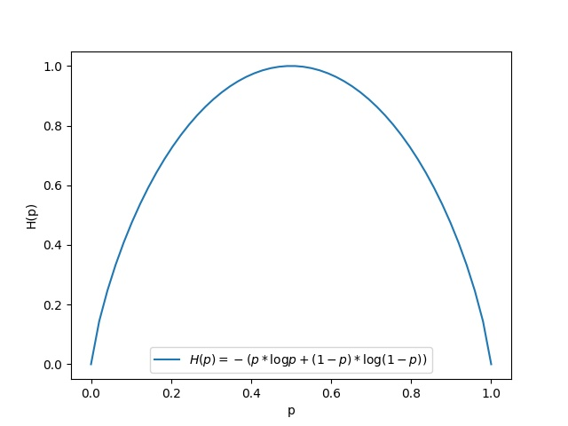
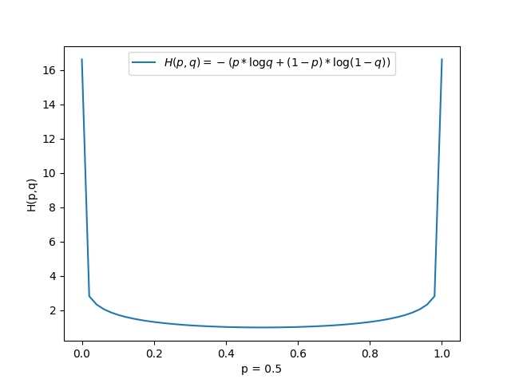
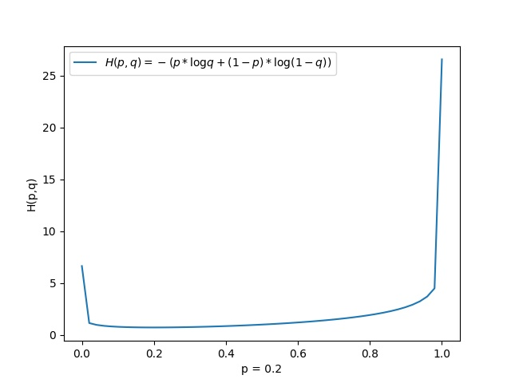
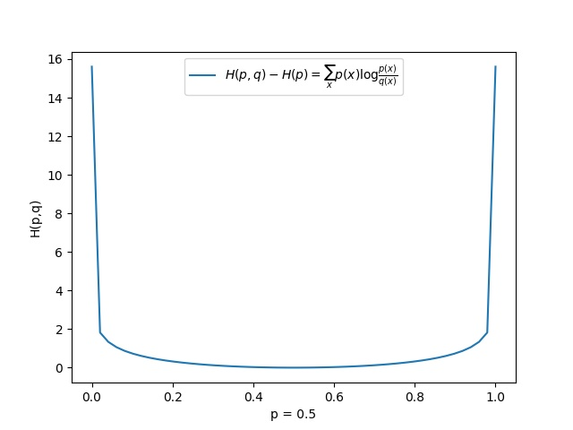

# 各种熵的理解

#### 理解概率分布函数和概率密度函数

> ##### 如果微积分是研究变量的数学，那么$\color{red}{概率论与数理统计是研究随机变量的数学}$

##### 研究一个随机变量，不只是要看它能取哪些值，$\color{red}{更重要的是它取各种值的概率如何！}$

概率分布函数是描述随机变量取值分布规律的数学表示。对于任何实数x，事件[X < x]的概率当然是一个x的函数，则有 F(x) = P(X < x),其中$F(-\infty) = 0,F(\infty)=1$,称 F(x)为随机变量X的分布函数。

常见的离散型随机变量分布模型有 "0-1分布","二项式分布“，”泊松分布“；连续型随机变量分布有”均匀分布”，“正态分布”。

| 变量类型       |  概率函数(某个值的概率用函数表示)    |    概率分布函数  |
| :------------- | ---- | ---- |
| 离散型随机变量 |   $p_i = P(X = x_i) = \frac{1}{8}$<br />$\sum_{i = 0}^{n}p_i = 1$   |  $F(x) = \sum_{x_i < n }{}p_i$  |
| 连续型随机变量 |   $f(x) = F'(X)$<br />$f(x) \geq 0,\int_{-\infty}^{\infty}f(x)\,dx = 1 $   | $F(x) = \int_{-\infty}^{x}f(x)\,dx$ |

离散型概率分布(重点在分布即可能取的所有值)：

| X(取值)       |  1    |  2    |   3   |   4   |  5    |  6    |
| ------------- | ---- | ---- | ---- | ---- | ---- | ---- |
| P(取值的概率) |   1/6   |   1/6   | 1/6     |  1/6    | 1/6    |   1/6   |

关于概率分布的描述角度：

1> 期望，反映随机变量平均取值的大小即从总体来看X$\color{red}{带概率的平均值}$，$E(X) = \sum_{k = 1}^{\infty}x_kp_k$,$E(x) = \int_{-\infty}^{\infty}xf(x)\,dx$

2>方差，度量随机变量和其数学期望之间的$\color{red}{偏离程度}​$。$D(X) = \sum_{i = 1}^{n}p_i(x_i-\mu)^2, \mu = E(X)​$; $D(X) = \int_{-\infty}^{\infty}(x-\mu)^2f(x)\,dx,\mu = E(X)​$

3>熵，随机变量不确定性的描述，不确定性越大，熵越大。$H(X) = -\sum_{i=1}^{n}p(x_i)logp(x_i)$

#### 熵(Entropy)

熵衡量不确定性的度量，熵越大，不确定性越大。可以从信息量的角度来理解。假设需要表示 8 个数字，则需要 $log_28 = 3​$个二进制来表示，如果是其他进制则是 $log_n 8 = m​$。m个这样的位来表示。$-log_2p(x_i) = log_2\frac{1}{p(x_i)}​$, 表示的含义是这个概率需要用多少个二进制来表示也即信息量，$\color{red}{所需要信息里越多，表示它的不确定性就越大}​$。

信息量的概率分布：

| X(取值)       |  1    |  2    |   3   |   4   |  5    |
| ------------- | ---- | ---- | ---- | ---- | ---- |
| P的信息量 |  $-log_2\frac{1}{6}$   |  $-log_2\frac{1}{6}$    | $-log_2\frac{1}{6}$     |  $-log_2\frac{1}{6}$    | $-log_2\frac{1}{6}$    |
| P(取值的概率) |   1/6   |   1/6   | 1/6     |  1/6    | 1/6    |

$H(X) = -\sum_{i=1}^{n}p(x_i)logp(x_i)​$  ,所以熵的公式也可以理解成发生事件所带来的信息量的期望，信息量越大，$\color{red}{不确定性越大}​$,它从整体上描述不确定性，而不是单纯概率大小比较。

例如：有硬币A，硬币B，A发生正面概率为$P_A$ = 0.9, 反面概率$P_a$=0.1 ，B发生的正面概率为$P_B$=0.5,反面概率为$P_b$=0.5, 

​	问：哪枚硬币比较可能出现正面？ 硬币 A ，因为 $P_A$ = 0.9 > $P_B$ = 0.5， 直觉是A容易发生，比较确定

​	问：哪枚硬币比较可能出现反面？ 硬币 B ，因为 $P_a$ = 0.1 < ​$P_b$ = 0.5,   直觉是B容易发生, 它只是某个事件的概率而不是整体描述。

而从函数图像可见，硬币 B 的熵比硬币A的大，硬币B的不确定性最大, 概率越均匀，不确定性越大



$$
0 \leq -\sum_{i = 1}^{n} {p(x_i)\log{p(x_i)}} \leq \log{n}
$$

$$
\begin{eqnarray} 证明(拉格朗日乘子法)：
		L(p(x_i),p(x_2),...,p(x_n),\lambda)
		&=& -\sum_{i=1}^{n}p(x_i)logp(x_i) + \lambda(p(x_i)+p(x_2),...,p(x_n) - 1)\\
		\frac{\delta L}{\delta p(x_i)}&=& -\log{p(x_i) - 1 + \lambda}\\
		设： \frac{\delta L}{\delta p(x_i)} &=& 0 \\
		-\log{p(x_i) - 1 + \lambda} &=&0\\
		p(x_i)&=& e^{\lambda - 1}\\
		n(e^{\lambda -1})&=&1\\
		p(x_i)&=& \frac{1}{n}\\
		-\sum_{i = 1}^{n} {p(x_i)\log{p(x_i)}}&=& -\sum_{i = 1}^{n} {\frac{1}{n}\log{\frac{1}{n}}}\\
		      &=& \log n\\
	\end{eqnarray}
$$


```python
# coding: utf-8
import numpy as np
import matplotlib.pyplot as plt
def binary_entropy(p, epslion=1e-10):
	return -(p * np.log2(p + epslion) + (1 - p) * np.log2(1 - p + epslion))
p = np.linspace(0, 1, 50)
entropy = binary_entropy(p)

plt.figure()
plt.plot(p, entropy,label="$H(p)=-(p*\logp + (1-p)*\log(1-p))$")
plt.xlabel('p')
plt.ylabel('H(p)')
plt.legend()
plt.savefig('./EntropyFunctionShow.jpg')
plt.show()
```


#### 联合熵

 假设有硬币A，B ，正面发生的概率分别为$p_A,p_B$, 则 A 与 B 的联合概率分布为：

| 取值 |  正，正    |  正，反    |   反，正   |  反，反    |
| ---- | ---- | ---- | ---- | ---- |
| 概率 |   $p_A*p_B$   | $p_A*(1-p_B)$     |  $(1-p_A)*p_B$    | $(1-p_A)*(1-p_B)$    |

按熵的定义：$H(X,Y) = -\sum_{x,y}p(x,y)logp(x,y)​$

从直观上来理解，一个变量概率分布，引入加一个变量概率，等于引入了另一份不确定性，所以应该会有 H(X) $\leq​$ H(X,Y), 假设 Y 的概率如果是 1 或者是 0 ，可以理解成Y已经确定了, H(X) = H(X,Y)。那为什么不是 $H(X) \geq H(X,Y)​$ ，只要证明 $H(X,Y) - H(X) \geq 0​$ 

证明：
$$
\begin{eqnarray}
		H(X,Y) - H(X)
		&=&-\sum_{x,y}p(x,y)logp(x,y) - (-\sum_{x}p(x)\log{p(x)})\\
		&=&-\sum_{x,y}p(x,y)logp(x,y) - (-\sum_{x,y}p(x,y)\log{p(x)}), X的边缘分布 p(x) = \sum_{y}p(x,y)\\
		&=&-\sum_{x,y}p(x,y)logp(x,y) + \sum_{x,y}p(x,y)\log{p(x)}\\
		&=&-\sum_{x,y}p(x,y)(\log{p(x,y) - \log{p(x)}})\\
		&=&-\sum_{x,y}p(x,y)(\log{\frac{p(x,y)}{p(x)}})\\
		&=&-\sum_{x,y}p(x,y)(\log{p(y|x)})\\
	\end{eqnarray}
$$

$$
0 \leq -\log{p(x)} ,则 -\sum_{x,y}p(x,y)(\log{p(y|x)}) ，即 H(X,Y) - H(X) \geq 0
$$


#### 条件熵(Conditional Entropy)

条件熵  $H(Y|X)$ 表示随机变量X确定的条件下，随机变量Y的不确定性，也可以理解成X给定的条件下$\color{red}{Y的条件概率分布的熵对X的期望}$，也可以理解成随机变量X在引入随机变量Y后所带来的不确定性。

例如：有2枚硬币A，B，在B硬币为正面时，A为正的概率为 P(A|b) = 0.8,则 A为反面的概率为 P(a|b) = 0.2 , 即当B取某个值时，与A的取值就会形成一个概率分布，是概率分布就应该有熵如图：

|      Y|  正面    |   反面   |
| ---- | ---- | ---- |
|    X ＝ b(反面)  |  p(A\|b)    |  p(a\|b)    |

当 X ＝ b 时，形成的概率分布，则它的熵是 $H(Y|X = b)​$其中 P(X = b) 也是一个概率

|      Y|  正面    |   反面   |
| ---- | ---- | ---- |
|    X ＝ B(正面)  |  p(A\|B)    |  p(a\|B)    |

当 X ＝ B 时，形成的概率分布，则它的熵是 $H(Y|X = B)$其中 P(X = B) 也是一个概率

所以条件熵的定义为:
$$
\begin{eqnarray}
		H(Y|X)
		&=&\sum_{i=1}^{N}p(x_i)H(Y|X=x_i),其中 N 为X可取的值\\
		&=&\sum_{i=1}^{N}p(x_i)(-\sum_{j=1}^{M}p(y_j|x_i)\log{p(y_j|x_i)})\\
		&=&-\sum_{i=1}^{N}\sum_{j=1}^{M}p(x_i)p(y_j|x_i)\log{p(y_j|x_i)} ,由于p(x_i)与后一个求和无关，所以前移不影响\\
		&=&-\sum_{i=1}^{N}\sum_{j=1}^{M}p(x_i,y_i)\log{p(y_j|x_i)}\\
		&=&-\sum_{x,y}p(x,y)\log{p(y|x)}\\
	\end{eqnarray}
$$
与前面联合熵的推导对比发现： 
$$
\begin{eqnarray}
		H(X,Y) - H(X)
		&=& H(Y|X)\\
		&=&-\sum_{x,y}p(x,y)\log{p(y|x)}\\
	\end{eqnarray}
$$


#### 交叉熵(Cross Entropy)

设有样本集的两个概率分布$p(x) 和 q(x)$,其中 $p(x)$  为真实分布，$q(x)$ 为非真实分布[可以理解成训练分布]，则有交叉熵为：
$$
H(p,q) = -\sum_{x} p(x)\log {q(x)}
$$
它表示的是非真实分布q(x)的不确定性在真实分布概率下的平均不确定性，描述了真实分布与非真实分布的关系，即q(x)不断逼近 p(x)时，值越小，当远离时，值越大。





```python
# coding: utf-8
import numpy as np
import matplotlib.pyplot as plt
p = 0.2
def binary_entropy(q, epslion=1e-10):
	return -(p * np.log2(q + epslion) + (1 - p) * np.log2(1 - q + epslion))
q = np.linspace(0, 1, 50)
entropy = binary_entropy(q)

plt.figure()
plt.plot(q, entropy,label="$H(p,q)=-(p*\logq + (1-p)*\log(1-q))$")
plt.xlabel('p = 0.2')
plt.ylabel('H(p,q)')
plt.legend()
plt.savefig('./CrossEntropyFunctionShow0.2.jpg')
plt.show()
```


从函数图像上可以发现，当 q(x) 越接近p(x) 时，交叉熵值越小，利用这一特性，$\color{red}{使用场景有交叉熵损失函数}​$。

#### 相对熵(Relative Entropy),也称为KL散度(Kullback-Leibler divergence)

从直觉上来看，当 q(x) 越接近 p(x) 交叉熵越小，是否可以说明，p(x) 本身的熵要比交叉熵小？
$$
\begin{eqnarray}
		H(p,q) - H(p)
		&=&-\sum_{x}p(x)\log{q(x)} - (-\sum_{x}p(x)\log{p(x)})\\
		&=&\sum_{x}p(x)\log{p(x)} - \sum_{x}p(x)\log{q(x)}\\
		&=&\sum_{x}p(x)\log{\frac{p(x)}{q(x)}}\\
		&=&D_{KL}(p||q)\\
	\end{eqnarray}
$$
设 p(x),q(x) 是离散型随机变量X中取值的两个概率分布，则 p 对 q 的相对熵是:
$$
D_{DL}(p||q) = \sum_{x}p(x)\log{\frac{p(x)}{q(x)}}
$$
性质：

1. 如果  p(x) 和 q(x) 两个分布相同时，那么相对熵等于 0.
2. $D_{KL}(p||q) \neq D_{KL} (q||p)​$ , 相对熵具有不对称性。
3. $D_{KL}(p||q) \geq 0 ​$

证明：$D_{KL}(p||q) \geq 0 $
$$
\begin{eqnarray}
		D_{KL}(p||q)
		&=&\sum_{x}p(x)\log{\frac{p(x)}{q(x)}}\\
		&=&－\sum_{x}p(x)\log{\frac{q(x)}{p(x)}}, Jensen 不等式，E(f(x)) \geq f(E(x)),这里的 f 为 \log 函数\\
		&\geq& -\log{E(\frac{q(x)}{p(x)})}\\
		&=&-\log{\sum_{x} p(x) \frac{q(x)}{p(x)}}\\
		&=&-\log{\sum_{x} q(x)}\\
		&=& 0 ,\sum_{x} q(x) = 1\\
	\end{eqnarray}
$$
关于相对熵的函数图像，从 $-\sum_{x}p(x)\log{q(x)} - (-\sum_{x}p(x)\log{p(x)})$ ,可以看出当p(x)确定后，$D_{KL}(p||q)$ 只与 q(x) 相关，所以函数与条件熵形状类似。

 

```python
# coding: utf-8
import numpy as np
import matplotlib.pyplot as plt
p = 0.5
def binary_entropy(q, epslion=1e-10):
	return +(p * np.log2(p + epslion) + (1 - p) * np.log2(1 - p + epslion))-(p * np.log2(q + epslion) + (1 - p) * np.log2(1 - q + epslion))
#概率取值
q = np.linspace(0, 1, 50)
entropy = binary_entropy(q)

plt.figure()
plt.plot(q, entropy,label=r"$H(p,q)-H(p)=\sum_{x}p(x)\log{\frac{p(x)}{q(x)}}$")
plt.xlabel('p = 0.5')
plt.ylabel('H(p,q)')
plt.legend()
plt.savefig('./RelativeEntropyFunctionShow.jpg')
plt.show()
```

相对熵(散度)描述的是交叉熵与信息熵的距离，也就是$\color{red}{非真实分布逼近真实分布的程度的度量}$。

#### 交叉熵损失函数

$$
H(p,q) = -\sum_{x} p(x)\log {q(x)}
$$

对于逻辑回归：
$$
h_{\theta}(x) = \frac{1}{1+e^{-\theta^Tx}}
$$
则 
$$
\begin{eqnarray}
		P(y = 1 | x;\theta)
		&=&h_{\theta}(x)\\
		P(y = 0|x;\theta)&=& 1 - h_{\theta}(x)\\
		p(y|x;\theta)&=& (h_{\theta}(x))^y(1-h_{\theta}(x))^{1-y}, 写成统一形式\\
		L(\theta)&=&\prod_{i = 1}^{m}p(y^{(i)}|x^{(i)};\theta), 根据最大似然函数\\
		&=&\prod_{i = 1}^{m}(h_{\theta}(x^{(i)}))^{y^{(i)}}(1-h_{\theta}(x^{(i)}))^{1-y^{(i)}}\\
		l(\theta)&=& \log{L(\theta)},两边取对数\\
		&=&\sum_{i=1}^{m}y^{(i)}\log{h_{\theta}(x^{(i)}) + (1-y^{(i)})\log{(1-h_{\theta}(x^{(i)})})}, 最终求极大值，前面加负数时就是最小值\\
	\end{eqnarray}
$$
逻辑回归属于二分类，对于每一个样本，要么 $y^{(i)} = 1$，要么 $y^{(i)} = $0

当 $y^{(i)} = 1$ 时，可以理解它的概率分布为：

|  $y^{(i)}$   |   1   |   0   |
| :--: | ---- | :--: |
|  真实概率    |   1   |   0   |
|  使用y表示    |  $y^{(i)}$   |  $1-y^{(i)}$   |
| 预测概率 | $h_{\theta}(x^{(i)})$ |$1－h_{\theta}(x^{(i)})$  |

则根据最交叉熵定义：
$$
\begin{eqnarray}
		H(p,q)
		&=&-\sum_{x} p(x)\log {q(x)},针对一个样本的概率分布\\
		&=&－(1*\log{(h_{\theta}(x))} + 0 * \log{(1-h_{\theta}(x)}))\\
		&=&－(y*\log{(h_{\theta}(x))} + (1-y) * \log{(1-h_{\theta}(x)}))\\
	\end{eqnarray}
$$

对比发现，利用最大似然函数和利用最小交叉熵得出的损失函数是一样的，这就说明为什么交叉熵损失函数能够使得真实分类的概率最大，而其他概率最小，$\color{red}{因为非真实概率不断逼近真实概率时，交叉熵会越小，同理可以推导到多分类。}​$

参考自：

条件熵理解：https://zhuanlan.zhihu.com/p/26551798

公式推导：https://www.cnblogs.com/kyrieng/p/8694705.html

直接理解熵：https://www.jianshu.com/p/09b70253c840

概率论公式参考：https://www.zybuluo.com/catscarf/note/984304