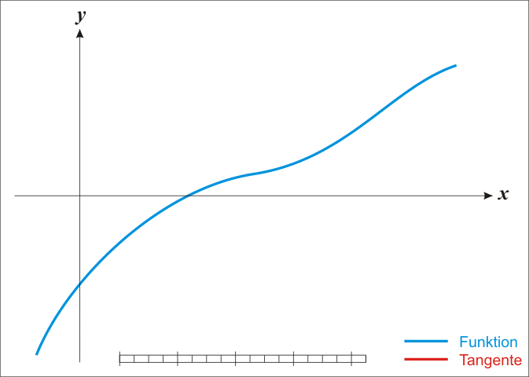

#### 无约束优化问题

无约束的优化问题，一般就是要使一个表达式取到最小值：
$$
minf(x) \\ 
如果是换成问题 maxf(x) 一般情况会转成 min(-f(x))
$$

所以在极值点处一定满足 $\frac{\partial f(x)}{\partial x}|_{x = x_0} = 0$ ，但这只是必要条件，具体还要根据实际情况判断是在 $x_0$ 的领域内满足 $f(x) \geq f(x_0)$ 或者 $f(x) \leq f(x_0)$,比如 $ f(x) = x^3$ 在 x ＝ 0 处就不是极值点。

有些问题很难解时，就需要梯度下降法、牛顿法、坐标下降法之类的数值迭代算法了

##### 梯度下降法

依靠梯度确定下降方向的方法叫做梯度下降法，流程如下：

1. 随机选择一个初始点或极值附近的点 $x_0$
2. 求解函数在 $x_0$ 的梯度，然后从 $x_0$向前走一步，迭代式子为 $x_0^{t+1} = x_0^{t} - \alpha \nabla f(x)$,其中 $\alpha$ 是为防止梯度过在时，跳过极值点，或太小时，迭代次数增加。
3. 重复步骤 2，直到梯度达到某个最小值，或者所求 x 达到某个迭代差值。

##### 坐标下降法

假设目标函数是多元函数，如 $f(x,y)$, 轮流求出其中某个变量的偏导，得到最优点，然后向偏导方向移动，称为坐标下降法，因为偏导数是沿着某个坐标轴。

依靠梯度确定下降方向的方法叫做梯度下降法，流程如下：

1. 随机选择一个初始点或极值附近的点 $x_0,y_0​$
2. 固定$y_0$求解函数在 $x_0$ 的梯度，然后从 $x_0$向前走一步，迭代式子为 $x_1^{t+1} = x_0^{t} - \alpha \frac{\partial f(x,y)}{\partial x}$,其中 $\alpha$ 是为防止梯度过在时，跳过极值点，或太小时，迭代次数增加。
3. 固定 x_1,求解函数在$y_0$的梯度，然后从 $y_0$向前走一步，迭代式子为 $y_1^{t+1} = y_0^{t} - \alpha \frac{\partial f(x,y)}{\partial y}$
4. 重复2 和 3 ，直到满足条件

##### 牛顿法

牛顿法应用场景

1. 求解方程的根

2. 最优化

   

前提泰勒公式(它表示的是某点附近领域内的近似值)
$$
f(x) = f(x_0) + f^{'}(x_0)(x - x_0) + \frac{1}{2!}f^{''}(x_0)(x - x_0)^2 + ...+ \frac{1}{n!}f^{(n)}(x_0)(x - x_0)^2 + R_n(x)
$$

###### 牛顿法－求方程的根

牛顿法是一种在实数域和复数域上近似求解方程的方法。方法是使用函数$f(x)$的泰勒级数的前面几项来寻找方程$f(x) = 0$的根。牛顿法最大的特点就在于它的收敛速度很快。

直观的理解是：求一阶导数为斜率，可以算出斜率方程，求出该方程与X轴交点即为下一个逼近X值。
$$
\begin{cases} 
		f(x_0) = f^{'}(x_0) * x_0 + b, 斜率方程在 (x_0,f(x_0)) \\ 
		0 ＝ f^{'}(x_0) * x_1 + b\\ 
	\end{cases}
$$

$$
x_1 = x_0 - \frac{f(x_0)}{f^{'}(x_0)}
$$

也可以通过一阶泰勒级数
$$
f(x) = f(x_0) + f^{'}(x_0) * (x - x_0) \\ 
令：f(x_1) 是近似解，则有 f(x_1) = 0 即：\\
f(x_0) + f^{'}(x_0) * (x - x_0) = 0 \\ 
所以 x_1 = x_0 - \frac{f(x_0)}{f^{'}(x_0)} \\ 
更一般迭代过程为：\\ 
x_{n+1} = x_{n} - \frac{f(x_n)}{f^{'}(x_n)}
$$

###### 牛顿法－最优化

 	求函数的极大或极小值，可以转化为求导数为0，这个必要条件，首先函数使用泰勒级数近似即
$$
f(x) = f(x_0) + f^{'}(x_0)(x - x_0) + \frac{1}{2!}f^{''}(x_0)(x - x_0)^2 + ...+ \frac{1}{n!}f^{(n)}(x_0)(x - x_0)^2 + R_n(x),取二阶可导即 \\
f(x) = f(x_0) + f^{'}(x_0)(x - x_0) + \frac{1}{2!}f^{''}(x_0)(x - x_0)^2 \\ 
f^{'}(x) =  f^{'}(x_0) + f^{''}(x_0)(x - x_0) ,令 f^{'}(x)  = 0 则 \\
x_{n+1} = x_{n} - \frac{f^{'}(x_n)}{f^{''}(x_n)} \\
$$
上面的求值只是针对 x 为一维的情况，当X为一个向量时，泰勒级数为：
$$
f(x) = f(x^{k}) + \nabla f(x^{k})(x - x^{k}) + \frac{1}{2}(x - x^{k})^{T}H(x^{k})(x - x^{k}) ,其中 H(x^{k}) 为海塞矩阵\\
对函数求导 \\ 
f^{'}(x) = \nabla f(x^{k}) + H(x^{k})(x - x^{k}) \\ 
令导数为 0 , 设 g_{k} = \nabla f(x^{k}), H(x^{k}) = H_{k}\\
x = x^{k} - H^{-1}(x^{k})\nabla f(x^{k}) \\ 
x^{k+1} = x^{k} - H_{k}^{-1}g_{k} \\ 
由于海塞矩阵的逆矩阵计算复杂，所以使用近似的矩阵替代，也称为拟拟牛顿法\\ 
$$

###### 拟牛顿法－最优化

待写

#### 有等式约束的优化问题(拉格朗日乘子法)

等式约束一般形式如下：
$$
min f(x) \\
s.t.h(x) = 0
$$

##### 高等数学拉格朗日乘子法推导

$$
\begin{eqnarray}
		z&=&f(x,y), 求极值函数\\
		\varphi&=&f(x,y) = 0 ,约束条件\\
	\end{eqnarray}
$$

假定在$(x_0,y_0)$的某一邻域内$f(x,y)$ 与 $\varphi (x,y)$ 均有连续的一阶偏导数，而$\varphi_{y} (x_0,y_0) \neq 0$[表示y的偏导]
$$
\begin{eqnarray}
		设 y&=&\varphi (x) \\
		则：z&=&f(x,\varphi (x))\\
		按一元函数求极值，求偏导：[\frac{\partial z}{\partial x}]_{x=x_0}&=&f_{x}(x_0,y_0) + f_y(x_0,y_0)[\frac{\partial y}{\partial x}]_{x=x_0} = 0\\
		\varphi=f(x,y)根据隐函数求导公式有：[\frac{\partial y}{\partial x}]_{x=x_0} &=&-\frac{\varphi_x(x_0,y_0)}{\varphi_y(x_0,y_0)},其中 \varphi_x 表示函数对 x 求偏导\\
		[\frac{\partial z}{\partial x}]_{x=x_0}&=&f_{x}(x_0,y_0) － f_y(x_0,y_0)*(\frac{\varphi_x(x_0,y_0)}{\varphi_y(x_0,y_0)}) = 0\\
		则有：\frac{f_{x}(x_0,y_0)}{\varphi_x(x_0,y_0)}&=&\frac{f_y(x_0,y_0)}{\varphi_y(x_0,y_0)}\\
		令：\frac{f_{x}(x_0,y_0)}{\varphi_x(x_0,y_0)}&=&\frac{f_y(x_0,y_0)}{\varphi_y(x_0,y_0)} ＝ －\lambda,\\
	即比较是线性关系： \nabla f(x,y)&=& -\lambda \nabla\varphi(x,y)\\
	\end{eqnarray}
$$
求解方程组：
$$
f(x,y)=\begin{cases} 
		f_{x}(x_0,y_0) ＋ \lambda *\varphi_x(x_0,y_0) = 0\\ 
		f_{y}(x_0,y_0) ＋ \lambda *\varphi_y(x_0,y_0) = 0\\ 
		\varphi(x,y) = 0\\ 
	\end{cases}
$$
其实相当于根据函数及约束条件构建函数：
$$
L(x,y) = f(x,y) + \lambda * \varphi(x,y),分别对 x,y 求偏导 \\
$$
从上面推导(参考高等数学)过程发现，$f(x)$ 的梯度与约束条件的梯度 $h(x)$ 平行，即有线性关系，从一张图直观感受一下它们的关系。（下图红色箭头表示，求极小值函数的负梯度，红色圈表示，极值函数的等高线。蓝色表示约束条件和在当前约束条件下的正梯度，对于圆圈而言，梯度垂直向外）

上图分三种场景来说明线性关系：

1. 场景一约束函数不包含求极值函数的最小值或最大值，两个梯度方向刚好相同 $\lambda > 0$

$$
\begin{eqnarray}
		f(x_1,x_2)&=& x_1^2 + x_2^2,求极值函数\\
		h(x_1,x_2)&=&x_1^2 + (x_2 - 4)^2  - 1 = 0,约束条件\\
		L(x_1,x_2) &=&  x_1^2 + x_2^2 + \lambda(x_1^2 + (x_2 - 4)^2 - 1) \\ 
		最终求出 \lambda = 3 \\
	\end{eqnarray}
$$

2. 场景二约束函数刚好经过求极值函数的最小值或最大值点 $\lambda = 0$
   $$
   \begin{eqnarray}
   		f(x_1,x_2)&=& x_1^2 + x_2^2,求极值函数\\
   		h(x_1,x_2) &=&x_1^2 + (x_2 - 4)^2 - 16 = 0 ,约束条件\\
   		L(x_1,x_2) &=&  x_1^2 + x_2^2 + \lambda(x_1^2 + (x_2 - 4)^2 - 16) \\ 
   		最终求出 \lambda = 0 ，因为不需要约束条件下也求出该极值，所以可以为0\\
   	\end{eqnarray}
   $$

3. 场景三约束函数的圈包含求极值函数的最小值或最大值点，两梯度刚好相反 $\lambda < 0$
   $$
   \begin{eqnarray}
   		f(x_1,x_2)&=& x_1^2 + x_2^2,求极值函数\\
   		h(x_1,x_2) &=&x_1^2 + (x_2 - 4)^2 - 36 = 0 ,约束条件\\
   		L(x_1,x_2) &=&  x_1^2 + x_2^2 + \lambda(x_1^2 + (x_2 - 4)^2 - 36) \\ 
   		最终求出 \lambda = -\frac{1}{3} \\
   	\end{eqnarray}
   $$
   

当有多个等式约束条件时，线性叠加就行，最终等式约束优化问题为：
$$
L(x) = f(x) + \sum_{i=1}^{n}\lambda_i h_i(x) ,其中 i 表示约束条件个数
$$

#### 有不等式约束的优化问题(常常使用的方法就是KKT条件)

当约束条件变成 $g(x_1,x_2) \leq 0$ 时，可以直观理解成约束条件刚好是一个圆包括它的边界，那么可以分为两种场景

1. 约束条件包含极值 (条件是 $\mu * g(x) = 0$)

   1.极值在边界上,则此时 $g(x) = 0$,且 $\mu = 0$

   2.极值不在边界上，此时求极值不需要约束条件即 $\mu = 0​$

2. 约束条件不包含极值 (条件是： $\mu \gt 0 ​$)

   不包含极值，则极值一定在相切的地方，直观上理解，它只能沿着等高线，而不会包含极值，因此有 $ - \nabla f(x) 与 \nabla g(x)$同方向，所以 $ - \nabla f(x) = \mu \nabla g(x)$,其中 $\mu \gt 0$

综上所述求极值场景：
$$
min f(x) \\
s.t.h(x) = 0 \\
s.t.g(x) \leq 0
$$
KTT 条件为：
$$
\begin{cases} 
		\nabla f(x) + \sum_{i=1}^{n}\nabla \lambda_i h_i(x) + \sum_{j=1}^{m}\nabla \mu_j g_j(x)\\ 
		\mu_j * g_j(x) = 0\\ 
		\mu_j \geq 0\\ 
		h_i(x) = 0 \\
		g_j(x) \leq 0 \\ 
	\end{cases}
$$

参考自：

梯度比较：https://www.jianshu.com/p/ee39eca29117

正定矩阵理解：

常见几种优化方法：https://www.cnblogs.com/shixiangwan/p/7532830.html

理解拉格朗日乘子法(KKT)：https://blog.csdn.net/weixin_41500849/article/details/80493712

《高等数学下册》

牛顿法参考(图)：https://www.cnblogs.com/shixiangwan/p/7532830.html

拟牛顿法推导参考：https://www.cnblogs.com/liuwu265/p/4714396.html