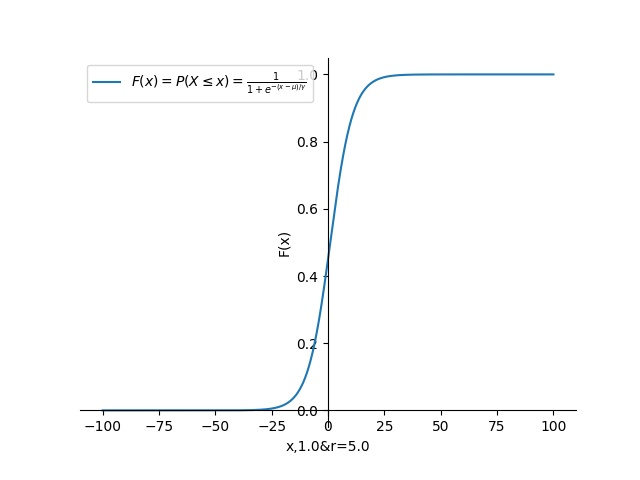
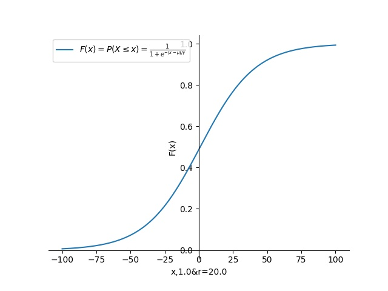
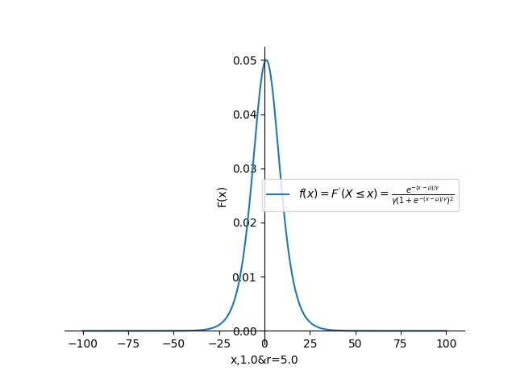

#### Logistic Distribution

设 X 是连续随机变量，X 服从Logistic Distribution 是指 X 具有下列分布函数和密度函数：
$$
F(x) = P(X \leq x) = \frac{1}{1+e^{-(x-\mu)/\gamma}}
$$

$$
f(x) = F^{'}(X \leq x) = \frac{e^{-(x-\mu)/\gamma}}{\gamma(1+e^{-(x-\mu)/\gamma})^2}
$$

其中，$\mu$ 为位置参数，$\gamma$ 为形状参数即曲线在中心附近增长速度快慢，形状参数 $\gamma$ 的值越小，曲线在中心附近增长得越快即越陡,图像关于 $(\mu,\frac{1}{2})$ 中心点对称，即满足：
$$
F(-x+\mu) - \frac{1}{2} = -F(x-\mu) + \frac{1}{2}
$$


| |    |      |
| ------------------------------------- | ---- | ---- |
|                                        |        |      |

```python
# coding: utf-8
import numpy as np
import matplotlib.pyplot as plt

u = 1
r = 5
def functionY(x):
   return 1/(1+np.exp(-(x-u)/r))
p = np.linspace(-100, 100, 50000)
entropy = functionY(p)

plt.figure()
plt.plot(p, entropy,label=r"$F(x) = P(X \leq x) = \frac{1}{1+e^{-(x-\mu)/\gamma}}$")
plt.xlabel('x,%.1f&r=%.1f'%(u,r))
plt.ylabel('F(x)')
plt.legend()
# 移动轴线到图中央
ax = plt.gca()
ax.spines['right'].set_color("none")
ax.spines['top'].set_color("none")
ax.spines['bottom'].set_position(("data",0))
ax.spines['left'].set_position(("data",0))
ax.xaxis.set_ticks_position('bottom')
ax.yaxis.set_ticks_position('left')

plt.savefig('./sigmoidShow_u=%.1f&r=%.1f.jpg'%(u,r))
plt.show()
```

从中心点可以知道，中心点导数最大，增长越快。

#### Logistic Distribution 模型

逻辑回归虽然有回归字样，但其实是一个分类模型，由条件概率分布 $P(Y|X)$ 表示，形式为参数化的逻辑斯谛分布模型：
$$
P(Y = 1 | x) = \frac{exp^{w^Tx + b}}{1 + exp^{w^Tx + b}}
$$

$$
P(Y = 0 | x) = \frac{1}{1 + exp^{w^Tx + b}} 
$$

这里，$x \in R^n$ 是输入，$Y \in {0,1}$ 是输出，$w \in R^n$ 和 $ b \in R$ 是参数， w 称为权值向量，b 称为偏置，$w^Tx$ 为 w 和 x 的内积。

有时为了方便，$ w = (w^{1},w^{2},...,b)^T$ , $x = (x^(1),x^(2),...,x^(n),1)^T$ ， 这时 $w^Tx + b $ 简写成 $w^Tx ​$

##### 几率(odds)

一个事件的几率(odds) 是指该事件发生的概率与该事件不发生的概率的比值，如果事件发生的概率是 P，那么该事件的几率是 $\frac{p}{1-p}$

##### 对数几率(log odds ) 

对数几率定义为: $logit(p) = log\frac{p}{1-p}​$

对于逻辑回归而言:
$$
logit(p) = log\frac{p}{1-p} = log\frac{P(Y = 1|x)}{1-P(Y|x)} = w^Tx
$$


#### 模型参数估计

设： $ z = w^Tx​$ ,  $\sigma(z) = \frac{1}{1+e^{-z}}​$

$$
\begin{eqnarray}
		z
		&=&w^Tx\\
		&&\\
		\sigma(z)&=&\frac{e^{w^Tx}}{1 + e^{w^Tx}}\\
		&=&\frac{e^{z}}{1 + e^{z}}\\
		&=&\frac{1}{1 + e^{-z}}, 分子分母同时除 e^z\\
		&&\\
		P(Y = 1 | x) &=& \sigma(z)\\
		P(Y = 0 | x) &=& 1- \sigma(z)\\
	\end{eqnarray}
$$

由极似然函数(逻辑回归服从伯努力分布，也称为0－1分布),求出参数的导数：
$$
\begin{eqnarray}
		L(z;w)
		&=&\prod_{i=1}^{N}[\sigma(z^{i})^{y^{i}}]*[(1-\sigma(z^{i}))^{1-y^{i}}],其中 N 为，样本的个数\\
		l(z;w) = \log(L(z;w))&=& \sum_{i=1}^{N} y^i \log(\sigma(z^i)) + (1-y^i)\log(1-\sigma(z^i))\\
		&&\\
		[\sigma(z)]^{'}&=&(1+e^{-z})^{-1}\\
		&=&-1 * ((1+e^{-z})^{-2}) * e^{-z} * (-1),对 \sigma(z) 求导\\
		&＝&\frac{e^{-z}}{(1+e^{-z})^2}\\
		&＝&\frac{1}{(1+e^{-z})} * \frac{1+e^{-z} -1}{(1+e^{-z})}\\
		&=& \sigma(z)(1-\sigma(z))\\
		&&\\
		&&\\
		\frac{\partial l(z;w)}{\partial z^{i}}&=& \sum_{i=1}^{N}(\frac{y^i*[\sigma(z^i)]^{'}}{\sigma(z^i)} + \frac{(1-y^i)*(-1)*[\sigma(z^i)]^{'}}{1-\sigma(z^i)})\\
		&=& \sum_{i=1}^{N}(\frac{y^i*[\sigma(z^i)]^{'}*(1-\sigma(z^i)) + (1-y^i)*(-1)*[\sigma(z^i)]^{'} * \sigma(z^i)}{\sigma(z^i)*(1-\sigma(z^i))}) ,通分\\
		&=& \sum_{i=1}^{N}(\frac{y^i*[\sigma(z^i)]^{'} - \sigma(z^i)*[\sigma(z^i)]^{'} }{\sigma(z^i)*(1-\sigma(z^i))}) ,代入 [\sigma(z^i)]^{'}\\
		&=&\sum_{i=1}^{N}(y^i - \sigma(z^i))\\
		&&\\
        \frac{\partial z}{\partial w}&=& \frac{\partial w^Tx}{\partial w}\\
        &=& x\\
        &&\\
        &&\\
        \frac{\partial z}{\partial w}&=& \frac{\partial w^Tx}{\partial w}\\
        \frac{\partial l(z;w)}{\partial z^{i}} * \frac{\partial z^i}{\partial w}&=& \sum_{i=1}^{N}(y^i - \sigma(z^i))*x^i\\
        \frac{\partial l(z;w)}{\partial w} &=& \sum_{i=1}^{N}(y^i - \sigma(z^i))*x^i\\
		
	\end{eqnarray}
$$


参数更新：
$$
\begin{eqnarray}
		w_j = 
		&=&w_j - \alpha * (-\frac{\partial l(z;w)}{\partial w_j} ),其中 j 表示第 j 个特征，前面求出的是最大值，取负号，变成最小值，梯度下降\\
		&=&w_j - \alpha * (-\sum_{i=1}^{N}(y^i - \sigma(z^i))*x_j^i)\\
		&=&w_j + \alpha * (\sum_{i=1}^{N}(y^i - \sigma(z^i))*x_j^i)\\
	\end{eqnarray}
$$


#### 为什么逻辑回归比线性回归要好？

1. 逻辑回归与线性回归从表达式上的区别是，逻辑回归多了一层 sigmoid 函数，它们都是广义的线性回归。
2. 线性回归在整个实数域内敏感度一致，而逻辑回归曲线在z＝0时，十分敏感，而远离0处时，输入的改变对输出的影响小。
3.  经典线性模型的优化目标函数是最小二乘法即平方差损失函数，而逻辑回归则是似然函数，

#### LR和SVM的关系

从函数图像上理解都是线性分类器，都是在找一个超平面，不同之处理在于LR，会不断在优化，使得样本不断地远离超平面，而SVM在找到超平面后，不再优化。

1. LR 考虑全部样本，而且全部需要远离 w*x + b = 0,而 SVM 只是局部。

#### 多分类 softmax 函数

$$
h_w(x^i) = \left[
    \begin{matrix}
   P(y^i = 1 | x^i;w_1 ) \\
    P(y^i = 2 | x^i;w_2 ) \\
  \cdots \\
   P(y^i = k | x^i;w_k ) \\
    \end{matrix}
\right]
= \frac{1}{\sum_{j=1}^{k}e^{w_{j}^Tx^i}}
=\left[
\begin{matrix}
e^{w_{1}^{T}x^i} \\ 
e^{w_{2}^{T}x^i} \\ 
\cdots \\
e^{w_{k}^{T}x^i} \\ 
\end{matrix}
\right]
$$

其中, $w_1,w_2,...,w_k \in R^{n+1}$ 是分类器参数，$ \frac{1}{\sum_{j=1}^{k}e^{w_{j}^Tx^i}}$   是对类别分布进行归一化，使得全部类别的概率之和为1。

softmax 回归独自的特点，求解出来的参数是冗余的，假设对每个参数向量 $w_j$ 减去向量 $\varphi$ 并不影响假设函数的类别输出，如果参数 $(w_i,w_2,...,w_k)$ 是代价函数的解，那么参数$(w_1-\varphi),w_2-\varphi,...,w_k-\varphi$ 也是代价函数的解,解决办法是加正则项。比如：
$$
\begin{eqnarray}
		P(y^i = j | x^i;w)
		&=&\frac{e^{(w_j - \varphi)x^i}}{\sum_{l=1}^{k}e^{(w_l- \varphi)x^i}}\\
		&=&\frac{e^{w_jx^i}*e^{-\varphi x^i}}{\sum_{l=1}^{k}e^{w_lx^i}e^{- \varphi x^i}}\\
		&=&\frac{e^{w_jx^i}}{\sum_{l=1}^{k}e^{w_lx^i}}\\
	\end{eqnarray}
$$
多分类的概率分布：

|   类别   |  1    |   2   |  ...    |  k    |
| ---- | ---- | ---- | ---- | ---- |
|  真实类别    | 0    |  j=1    |  ...    |  0    |
|   真实概率p(x)   |  0    |  1    |  ...    |    0  |
|  训练概率q(x)  |   $\frac{e^{w_1x^i}}{\sum_{l=1}^{k}e^{w_lx^i}}$    |  $\frac{e^{w_2x^i}}{\sum_{l=1}^{k}e^{w_lx^i}}$     | ...     |  $\frac{e^{w_kx^i}}{\sum_{l=1}^{k}e^{w_lx^i}}$     |

概率交叉熵定义：
$$
H(p,q) = -\sum_{x} p(x)\log {q(x)}
$$
多分类的交叉熵损失函数为：
$$
\begin{eqnarray}
		loss(w) 
		&=&-\frac{1}{m} \sum_{i=1}^{m} \sum_{j=1}^{k}1\{y^i = j\} \log{\frac{e^{w_jx^i}}{\sum_{l=1}^{k}e^{w_lx^i}}},其中 1\{y^i = j\} 相等为1，不相等为0\\
		&&\\
		&& 设：z_j = w_jx^i, P_h = \frac{e^{z_h}}{\sum_{l=1}^{k}e^{z_l}}\\
		&=&-\frac{1}{m} \sum_{i=1}^{m} \sum_{j=1}^{k}1\{y^i = j\} \log{\frac{e^{z_j}}{\sum_{l=1}^{k}e^{z_l}}}\\
		\frac{\partial loss(z;w)}{\partial z_h}&=&-\frac{1}{m} \sum_{i=1}^{m} [\sum_{j=1}^{k}1\{y^i = j\} \log{\frac{e^{z_j}}{\sum_{l=1}^{k}e^{z_l}}}]^{'},其中 h 表示取哪个参数列，分两种情况，h = j 和 h \neq j 分别求导\\
		&=&-\frac{1}{m} \sum_{i=1}^{m} (\sum_{j=1,j\neq h}^{k}1\{y^i = j\}(\frac{\sum_{l=1}^{k}e^{z_l}}{e^{z_j}} * (\frac{e^{z_j} * (-1)*e^{z_h}}{(\sum_{l=1}^{k}e^{z_l})^2}))) + 1\{y^i = j\}(\frac{e^{z_j}}{\sum_{l=1}^{k}e^{z_l}}+\frac{\sum_{l=1}^{k}e^{z_l}}{e^{z_j}} * (\frac{e^{z_j} * (-1)*e^{z_h}}{(\sum_{l=1}^{k}e^{z_l})^2})),前部分是对 h \neq j 求愤，后半部分是 h = j \\
		&=&-\frac{1}{m} \sum_{i=1}^{m} (\sum_{j=1,j\neq h}^{k}1\{y^i = j\} (-P_h)) + 1\{y^i = j\}(1-P_h),前部分是对 h \neq j 求愤，后半部分是 h = j \\
		&=&-\frac{1}{m} \sum_{i=1}^{m} (\sum_{j=1,j\neq h}^{k}1\{y^i = j\} (-P_h)) - 1\{y^i = j\}P_h + 1\{y^i = j\},把后面拆开，合并到求和里面\\
		&=&-\frac{1}{m} \sum_{i=1}^{m} (1\{y^i = j\} －\sum_{j=1}^{k}1\{y^i = j\} P_h) \\
		&& 对于每一个样本，示性函数从1到k只有一个为1，其他为 0,此时， y^i = h,所以\\
		&&\sum_{j=1}^{k}1\{y^i = j\} P_h ＝ P_h\\
		&=&-\frac{1}{m} \sum_{i=1}^{m} (1\{y^i = h\} － P_h)\\
		&&\\
		&&具体参数求导\\
		\frac{\partial z_h}{\partial w_{ht}}&＝&\frac{\partial (w^Tx)}{\partial w_{ht}}\\
		&＝&x_t,其中 t 表示第 t 个特征\\
		&&\\
		\frac{\partial loss(z;w)}{\partial w_{ht}}&＝&\frac{\partial loss(z;w)}{\partial z_h} *\frac{\partial z_h}{\partial w_{ht}}\\
		&＝&-\frac{1}{m} \sum_{i=1}^{m} (1\{y^i = h\} － P_h)x_t
	\end{eqnarray}
$$


对比逻辑回归与softMax:
$$
\begin{eqnarray}
		 \frac{\partial l(z;w)}{\partial w} &=& \sum_{i=1}^{N}(y^i - \sigma(z^i))*x^i\\
		 &&\\
		 &&抛开多个样本，参数求导是一样的，逻辑回归只有 w 一个参数列向量，而 多分类是多个列向量，针对哪个列向量求导时，以哪个列向量的概率为主\\
		 && y^i 与 1\{y^i = h\} 都是示性函数，真为 1 ，假为 0 \\
		\frac{\partial loss(z;w)}{\partial w_{ht}}&＝&-\frac{1}{m} \sum_{i=1}^{m} (1\{y^i = h\} － P_h)x_t
	\end{eqnarray}
$$
解决多组解的问题，加L2正则项，所以最终损失函数为：
$$
\begin{eqnarray}
		loss(w) 
		&=&-\frac{1}{m} \sum_{i=1}^{m} \sum_{j=1}^{k}1\{y^i = j\} \log{\frac{e^{w_jx^i}}{\sum_{l=1}^{k}e^{w_lx^i}}} ＋ \frac{\lambda}{2}\sum_{i=1}^{k}\sum_{t=1}^{T}w_{it}^2,其中 1\{y^i = j\} 相等为1，不相等为0,t 表示第 t 个特征，T 表示特征的个数,k 特征分类的个数\\
	\end{eqnarray}
$$


#### 逻辑回归与最大熵模型

由前面可以知道，多分类 softmax 是逻辑回归的扩展，所以softmax 的表达式同样可以用在逻辑回归上，根据多分类的可以知道的性质：
$$
\begin{eqnarray}
		 \frac{\partial z_h}{\partial w_{ht}} &=& -\frac{1}{m} \sum_{i=1}^{m} (1\{y^i = h\} － P_h)x_t\\
		 P_h&＝&\frac{e^{z_h}}{\sum_{l=1}^{k}e^{z_l}}\\
		 \sum_{h=1}^{k}p_h&＝&1\\
		&&\\
		&&根据熵的定义\\
		H(P)&=&-\sum_{h=1}^{k}p_h \log{p_h}\\
		&&根据拉格朗日求极有约束条件解有：\\
		L(P_h)&=&-\sum_{h=1}^{k}p_h \log{p_h} + \lambda_h ((1\{y^i = h\} － P_h)x_t) + \beta(\sum_{h=1}^{k}p_h - 1)\\
		\frac{\partial L(P_h) }{\partial P_h}&=&-(\log{p_h} + 1) + \lambda_h x_t + \beta 令导数为 0 则有：\\
		P_h&=&e^{\lambda_h x_t + \beta -1}\\
		&&而 \sum_{h=1}^{k}p_h ＝ 1， 则有：\\
		 \sum_{h=1}^{k}(e^{\lambda_hx_t + \beta -1})&＝&1\\
		e^{\beta}&＝&\frac{1}{\sum_{h=1}^{k}(e^{\lambda_hx_t-1})},代入 p_h 等式中有：\\
		P_h&＝&e^{\lambda_h x_t} * e^{\beta} * e^{-1}\\
		&＝&e^{\lambda_h x_t} * (\frac{1}{\sum_{h=1}^{k}(e^{\lambda_hx_t-1})}) * e^{-1}\\
		&＝&\frac{e^{\lambda_h x_t}}{\sum_{h=1}^{k}(e^{\lambda_hx_t})}\\
	\end{eqnarray}
$$


结论：最大熵是一种思想，在没有约束的条件下，概率越均匀熵越大，认为模型模型。在满足逻辑回归约束的条件下，求出来的最大熵模型跟逻辑回归本质上是一样。


参考自：

正则化项：https://blog.csdn.net/zouxy09/article/details/24971995

最大䊞推导出逻辑回归形式：https://blog.csdn.net/cyh_24/article/details/50359055

调参小结：https://www.cnblogs.com/pinard/p/6035872.html

比较详细的说明：https://www.jianshu.com/p/aa73938f32ee

LR与SVM对比：https://blog.csdn.net/zwqjoy/article/details/82312783

GBDT + LR : https://www.cnblogs.com/wkang/p/9657032.html

最大熵与LR关系：《The equivalence of logistic regression and maximum entropy models》