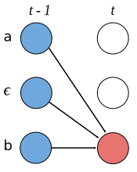
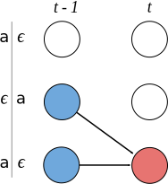

### CTC(Connectionist Temporal Classification)

##### 语音识别问题

输入是一份分割的语音$X$,一序列帧：
$$
X = \{X_1,X_2,...,X_T\}
$$
然后在 $t$  时刻的每一帧 $X_t$，由G图谱组成：
$$
X_t = [x_{t,1},...,x_{t,G}]
$$
可以使用 RNN 针对每一个 $X_t$ l输出 $Y_t$:
$$
Y = \{Y_1,Y_2,Y_3,...,Y_T\}
$$
而每一个输出 $Y_t$ 是字母表概率分布 ：
$$
y_t = [y_{t,1},y_{t,2},...,y_{t,K}]^T,其中 y_{t,k} = P(l_{t} = k) 而 l_t 表示K所代表的字母在 t 时刻的发音
$$
怎么解析 $y$ 所代表的字母序列？直觉上，只需要找到一个路径:
$$
\pi = \{\pi_{1}...\pi_{T}\}, \pi_t \in [1,K] \\
\pi = argmax_{\pi} P(\pi|y) \\ 
P(\pi|y) = \prod_{t=1}^{T}y_{t,\pi_t} \\ 
或者 \\
P(\pi|y) = \prod_{t=1}^{T}y_{t,\pi_t}P(\pi_t|\pi_{t-1}) ,根据 n-gram 语言模型\\ 
$$
但是现实是无法解决的，比如说 "a" 的时候，它可能有停顿或延长，此是的路径 $\pi$ 可能为:

aaaaaaaa

aaaaa_ _ _ 

_ _ _ _ aaa

_ _ _ aaa_

所以说真正的输出不是  $y$ 也不是$\pi$ ,而是最终的标签，用 $l$ 表示：
$$
l = \{l_1,l_2,...l_S\}, S \le T
$$
 比如前面说 "a" ，对应的标签就是 $l = \{a\}$. 再比如标签 $l = \{h,e\}$ , 则它的输出是:

hhheee

_ _ hee

但是当真实输出有连续相同的字母时，如 $ l = \{b,e,e\}$ 时，当去掉重复发音时，不可能知道，需要保留哪些e, 而 $ p (b,e,e) = p (\_,b,\_,e,\_,e,\_)$ 也就是在字母中间添加空格后，与原来概率相同，而把发音当中重复的字母去掉，就可以得到最终的字符串。

所以最终的概率是：
$$
P(l|x) = \sum_{\pi}P(l|\pi)P(\pi|X) \\ 
P(l|\pi)=\begin{cases} 
		1, & 如果 \pi 匹配 l \\ 
		0, & 否则 
	\end{cases} \\
	p(\pi|x) = \prod_{t=1}^{T}y_{t,\pi_t}
$$

##### 动态时间规划

首先最终的标签是  $l = \{b,e,e\}$ 等价于 $ l^{'} = \{,b,,e,,e,\}$ 也就是在字母中单添加空格

假设发音的输出是(设为字符串A): 

_ _ _ bbeeee_ _ _ 

而  $ l^{'}$ 是(设为字符串B)：

\_b\_e\_e\_

把它看成字符串最短编辑距离看，使用动态规划，设 $\alpha_{t}(s)$  表示 t 时刻 $l^{'}_{s}$ 的概率总和：

A 映射到 B 分两种情况:

1. A 与 B 一一对应 $\alpha_{t-1}(s-1)​$
2. A 有而 B 没有，也就是A必须删除 $\alpha_{t-1}(s)​$

此时规划转移方程为：
$$
\alpha_{t}(s) = \alpha_{t-1}(s) + \alpha_{t-1}(s-1) , 回想一下,t 是列，s 是行，从左到右就是删除,为什么没有 \alpha_{t}(s-1)因为没有新增这种场景
$$
 空格是人为添加的，当发音是正常的时候如: bbbbeee, 这时候不应该强制转换成空格，而应该是忽略这个空格。

按是否忽略空格分类(想不明白时，画字符串编辑距离动态规划来分析)：

1. 忽略空格

   当 $l_{s} \neq 空格,且 l_{s} \neq l_{s-2} 时 ​$，因为当 $ l_{s} = l_{s-2} 时,l_{s-1} 必然是空格，而些时的空格不应该被忽略，否则相同无法识别 ，所以忽略能取 \alpha_{t-1}(s-2) ​$

   

2. 不能忽略空格(为需要忽略空格)

   当 $l_{s} = 空格时，l_{s-1} 必然是一个字母，所以不用考虑忽略的问题，l_{s} = l_{s-2} 时,l_{s-1} 必然是空格,不能忽略 ​$

###### 总结CTC理解关键步骤：

1. 输入 X 经过RNN ，输出Y，取出 Y 的其中一条路径，形如：\_ \_ \_ bbeeee\_ \_ \_  设为字符串A

2. 目标 label 是 bee, 在两边添加空格，每个字母中间也添加空格，最后形成 {\_,b,\_,e,\_,e,\_}, 设为字符B，(添加空格原因是，训练出来有空格的字符串，去掉重重后就可以得出最终字符串)

3. 考虑 A －> B 的编辑距离即 $\alpha_t(s)​$  可从哪几个值取,根据动态规划转移方程，一般考虑$\alpha_{t-1}(s)  ​$、$\alpha_{t-1}(s-1)​$、$ \alpha_{t}(s-1)​$

   直观从字符串理解：

   1. 当 A(_ \_ \_ bbeeee\_ \_ \_ )长度比B(\_,b,\_,e,\_,e,\_) 长时如：，显然 A 是需要删除字符，对应 $\alpha_{t-1}(s)  ​$
   2. 当 A 与 B 某些字符一一对应时，对应 $\alpha_{t-1}(s-1)​$
   3. 当 A(bee) 比 B(\_,b,\_,e,\_,e,\_) 长时，相当于 B 需要删除字符，但这里是获取的概率，考虑把它(s-1 = 空格)忽略，即同时取概率 $ \alpha_{t-1}(s-2)​$
   4. 针对字符串B(\_,b,\_,e,\_,e,\_)特殊的场景，即 s = 空格时，是没有空格可以忽略的，当 s -2 = s 时，s - 1 肯定是空格，但这时的空格是不能忽略的
   5. 最终只需要考虑$\alpha_{T}(| l^{'}| - 1)$ + $\alpha_{T}(| l^{'}|)$ 即终两个节点的和

所以最终前向状态转换方程为：
$$
\alpha(t,s)=\begin{cases} 
		y_{t,l_{s}^{'}}(\alpha(t-1,s) + \alpha(t-1,s-1)), & 当 l_{s} = l_{s-2} 或者 l_{s} = 字格时 \\ 
		y_{t,l_{s}^{'}}(\alpha(t-1,s) + \alpha(t-1,s-1) + \alpha(t-1,s-2)), & 否则 
	\end{cases} \\
	\alpha(1,1) = y_{1\_} 取到空格的概率 \\
	\alpha(1,2) = y_{1,l^{'}_{1}} \\
	\alpha(1,s) = 0, s > 2 \\
$$

同理后向状态转换方程为：
$$
\beta(t,s) = P(l_{s:|l^{'}|}^{'},\pi_t = l_{s}^{'}|X)  \\
\beta(t,s)=\begin{cases} 
		y_{t,l_{s}^{'}}(\beta(t+1,s) + \beta(t+1,s+1)), & 当 l_{s} = l_{s-2} 或者 l_{s} = 字格时 \\ 
		y_{t,l_{s}^{'}}(\beta(t+1,s) + \beta(t+1,s+1) + \beta(t-1,s+2)), & 否则 
	\end{cases} \\
	\beta(T,|l^{'}|) = 1\\
	\beta(T,|l^{'}|-1) = 1 \\
$$

#### 预测

当训练好一个模型后，输入X，目的是计算输出：
$$
Y ＝ argmax_{Y} = p(Y|X)
$$

##### 两种算法解决：

###### 贪婪算法

取RNN每次输出概率最大的节点
$$
A ＝ argmax_{A} \prod_{t=1}^{T} P_t(a_t|X)
$$
但是这种情况不一定是最做做优解，例如：[a,a,_] 和 [a,a,a] 各自的概率均小于 [b,b,b] 的概率，但是他们相加的概率比 [b,b,b]高，所以应该取[a] 更加合理

###### Beam search 

Beam search算法，该算法有个参数叫做宽度，假设宽度设为3，每次计算 t 都是基于 t-1 输出最高三个查找当前概率最高的三个。当宽度为1时，就是贪婪算法。

##### CTC的特征

1. 条件独立：CTC其假设每个时间片都是相互独立的，这是一个非常不好的假设。在OCR或者语音识别中，各个时间片之间是含有一些语义信息的，因此如果能够在CTC中加入语言模型的话效果应该会有提升。

2. 单调对齐：CTC的另外一个约束是输入X XX与输出Y YY之间的单调对齐，在OCR和语音识别中，这种约束是成立的。但是在一些场景中例如机器翻译，这个约束便无效了。

3. 多对一映射：CTC的又一个约束是输入序列X XX的长度大于标签数据 Y YY的长度，但是对于X XX的长度大于Y YY的长度的场景，CTC便失效了。

参考自：

[Sequence ModelingWith CTC](https://distill.pub/2017/ctc/)

《Connectionist Temporal Classification: A Tutorial with Gritty Details》